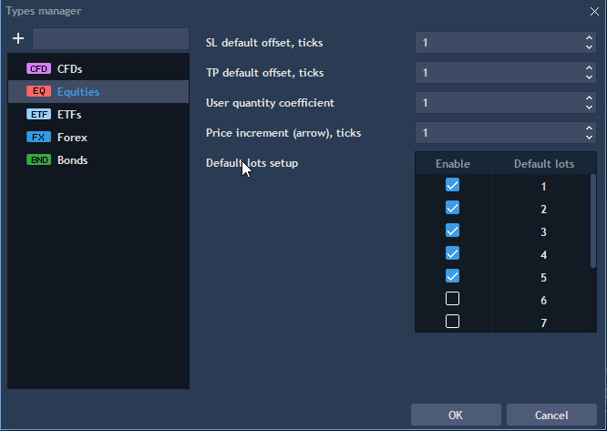
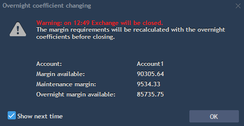

# General settings

The General settings menu is used to view and change general properties of the trading terminal. In order to open it, click on the buttonat the top of the terminal.

### **General**

* Language - specifies a default language of a user interface. To set up language, select it from the list;
* Info bar - allows displaying Info bar;
* Enable sounds - allows to switch on or switch off the sounds in the platform;
* Synchronize cursor - allows synchronization of cursors on different charts which are opened in the terminal;
* Mouse wheel - allows to scroll the chart or to zoom it while scrolling the mouse wheel.

### **View**

* Rounded average open price – if checked, open price of positions will be rounded in Watchlist, Positions, Filled orders, Market depth and other panels \(tick size=instrument tick size\);
* Display quantity in lots – if checked, orders quantity is shown in lots; otherwise — in units;
* Abbreviate volumes – if checked, volume values will be abbreviated in all panels. For example: 1000 will be displayed as 1K, and 1000000 – 1M;
* Reverse buttons order – if checked, trading buttons will be reversed to Sell/Buy pattern;
* Display quantity in absolute – if checked, quantity for sell orders and short positions with positive values are shown;
* Tooltips – if checked, all tooltips will be shown in the application; otherwise – will be hidden. This option is true by default.

### **Trading defaults**

* Account – specifies an account used by default, available for a multi-account user;
* Symbol – specifies a symbol used by default. This is the instrument that will be shown first when you load the Chart panel or Order entry panel;
* Set SL/TP values in offset \(for new orders\) – if checked, order prices are shown in offset, if unchecked – in absolute values;
* Show offset in – allows to select one of the available modes for offset displaying:
  * Ticks;
  * Ticks \(fractional ticks for Forex\);
  * Points.
* Use stop limit instead stop – allows placing stop limit orders instead of stop orders. When checked, the field 'Limit offset, ticks' becomes available;
* Limit offset, ticks – allows to adjust a default quantity of ticks for offset of a limit price. Available when 'Use stop limit instead stop' is checked;
* Order type – allows specifying order type, available values: Market, limit, Stop, Stop Limit, Tr. stop, OCO, Manual;
* Market/Limit\(Stop limit\)/Stop TIF – allows setting up TIF for market/limit \(stop limit\)/stop orders respectively, actual for both auto and manual trading;
* Types manager – allows setting defaults.

To specify additional settings for orders you need to open 'Types manager' and select a symbol type - Forex, Futures, Equities, etc. for which you want to set up default lots values. It is also possible to override default lots values for separate symbols by adding them to the symbol types tree using "+" button. In order to apply symbol type default lots settings, just delete symbol from the tree using context menu:

* SL/TP default offset, ticks – specifies a default value of offset field for SL/TP;
* User quantity coefficient – is a default increment applied to all quantity counters;
* Price increment \(arrow\), ticks – determines the increment value \(e.g. the Limit price field in the Order entry panel\) when pressing the Up Arrow \(^\) key;
* Default lots setup – allows enabling default lot sizes for orders of selected symbol types or specific symbols which will be available in OE section.

If 'Show offset in = Ticks \(fractional ticks for Forex\)', then options 'SL/TP default offset, ticks' in the Forex instrument type will be displayed in decimal view and in the corresponding format. For example, 10 ticks will be displayed as 1.0, and 50 ticks as 5.0, depending on which value is set in the option. If 'Show offset in' is NOT 'Ticks \(fractional ticks for Forex\)', values of the options 'SL/TP default offset, ticks' are displayed by default, e.g. 10 ticks, 50 ticks.

### Confirmations


In Confirmations section all of the options are fairly intuitive:

* When Confirm order placement is checked, order placement must be approved;
* When Confirm order cancellation is checked, cancellation of an order must be approved;
* When Confirm order/positions modification is checked, modification of an order/position must be approved;
* When Confirm position closing is checked, closing a position must be approved;
* When Confirm position reversing is checked, reversing a position must be approved;
* When Confirm order placement \(Trading idea\) is checked, order placement must be approved.

### **Warnings**

* Warn if wrong order – if checked, you get a warning message in case of placing order with incorrect parameters;
* Warn if today's volume exceeds - allows to select today volume level at which the system will display a warning message;
* Warn if order quantity exceeds – allows to select a quantity level at which the system will display a warning message;
* Warn if order capital exceeds – allows to select an order capital level at which the system will display a warning message;
* Warn if available funds less – allows to select available funds level at which the system will display a warning message;
* Warn if today's gross less – allows to get a warning message in case if a level of today gross is less than in set parameter;
* Show symbol halt warnings – if checked, you will get a warning message in case a trading halt on symbol occurs;
* Warn if close Strategy manager with active strategies – if checked, you will get a warning message in case Strategy manager is closed with active strategies;
* Show overnight margin notification message – if checked, you will get a warning message in case if a position is transferred overnight.


If you have open positions on symbols which have overnight coefficients, you will get overnight margin notification message "Warning: on 12:49 Exchange will be closed. The margin requirements will be recalculated with the overnight coefficients before closing".

The overnight warning message shows the following items: Account \(Account for which the margin coefficients are switched to overnight\), Margin available, Maintenance margin \(based on overnight coefficients\), Overnight margin available.

Overnight margin available = Balance + all risks - Overnight total maint. req.

If Overnight margin available &lt; 0, user will get a message "You don’t have enough margin for overnight, we force close some positions and cancel orders".

### RSS


Using this settings section, the user can add or edit RSS feeds in order to view news through RSS panel.  
Read more about RSS panel here: 

[https://guide.traderevolution.com/project/desktop-application-for-windows/informative-panels/rss](https://guide.traderevolution.com/project/desktop-application-for-windows/informative-panels/rss)_._

