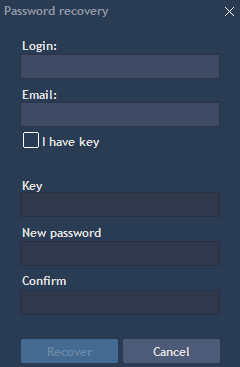
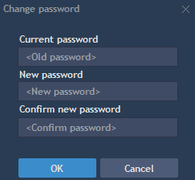

# Installation and updates

The application for Desktop uses a self-updating installation which means the latest available version of the program is automatically installed. The average download size is 30 MB.

To install the application for Desktop just run the .exe file. During installation you will be prompted to choose the installation directory.

### **Updating the program**

Every time starting the application for Desktop, the Update manager checks for updates automatically.

When an update is available, the update icon will appear at the top of the terminal:

The icon remains visible until a user update the terminal to the latest version. To install new version, click on the update icon.

### **Uninstall**

To uninstall the application, select Start -&gt; Programs -&gt; 'Name of terminal' -&gt; Uninstall. User can also uninstall the application through the Control panel in the Start menu on Windows.

Uninstalling the application won't remove default settings or connections. These data are stored in your profile folder, which is located in one of the following locations, depending on your operation system:

Windows 2000, XP, Server 2003 - Documents and Settings\&lt;UserName&gt;\Application Data\Folder with terminal.

Windows Vista, Windows 7, Win 8.1/10 - Users\&lt;UserName&gt;\AppData\Roaming\Folder with terminal.

Any version of the application that you install, after removing the application for Desktop will continue to use the data from this profile folder.

### **Login screen**

The first time running the application for Desktop there will be a default connection set up, so user can simply enter the login and password to connect.

### **Changing password**

Passwords can be changed anytime by using the following methods:

1. Before login to the application for Desktop:

If user forgot his password and needs to log in, simply click on the "Forgot password" button on the main login screen.

To recover the password:

* enter Login ID in the Login field;
* enter email in the Email field;
* click Recover to receive an email with a recovery key. Then enter this key to the field.

2. After login to the application for Desktop:

To open the "Change password" / "Change trading password" window, select it in the Account menu:

Change password - allows changing the password which is entered to login into the terminal.

Change trading password - allows changing the password which is entered before making any trading operation.

To change the password:

* enter current password in the Current password field;
* enter new password in the New password field;
* re-enter new password in the Confirm new password field;
* click OK to apply the new password.

**Errors arising when changing the password**

When changing the password the user may have some problems, at which the following error messages will be displayed:

1. Incorrect current password or login - the message appears if the old password is incorrect or the user does not already exist in the system.
2. Incorrect new password: you cannot use the same password - the message appears if the user enters a new password, which coincides with the old password.
3. New password contains prohibited symbols - the message appears if new password contains prohibited symbols \(for example, & etc.\).
4. Password cannot be the same as login - this message is displayed if the new password matches the login.
5. Please enter new password - this message is displayed when new password has not been sent to the user or the new password field is empty.
6. Incorrect new password: password should contain 1 number and 1 uppercase letter - this message is displayed if the new password does not meet the required level of password protection \(Strong Password required, low level of protection\).
7. Incorrect new password: password should contain at least 8 chars and numbers - this message is displayed if the new password does not meet the required level of password protection \(Strong Password required, low level of protection\).
8. Incorrect new password: password should contain at least 8 symbols including chars, numbers and special symbols - this message is displayed if the new password does not meet the required level of password protection \(Strong Password required, low level of protection\).

