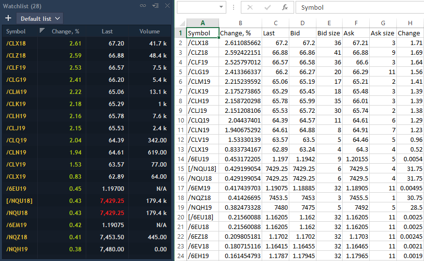

# Panel settings

The menu Settings can be opened through the Context menu, right click anywhere and select Settings. See an example of the settings dialog window below:


**General tab** allows changing view of tables.

**View**

* Grid – allows showing grid between columns and rows \(you can select the following options: Vertical, Horizontal, Vertical & horizontal, None\).
* Autosize of columns – automatically sizes columns so that their total width would be equal to the width of a panel. If disabled, each column will be sized by maximum length.
* Auto re-sorting – allows auto re-sorting a table after any changes.
* Show totals – allows showing total amount for columns. Be attentive to mark the "Show total" option as checked as well for selected columns in the Columns tab .
* Show toolbar – allows showing panel toolbar.

####  
**Colors**

The Colors sub-menu allows configuring the color scheme for tables:

* Text colors - the static cell text color \(text color\).
* Background colors - the static cell background color.

 **Columns tab** allows changing columns settings.

####
**Displaying and hiding columns**

The Columns box on the left lists the columns available in the panel. The columns with the blue checkbox are currently visible. To display or hide a column, check or uncheck an appropriate box and click apply.

#### **Reordering columns**

To reorder columns, click on a desired column and drag it to the desired location while holding the left mouse button.

#### **Configuring each column**

To configure settings for a specific column: select the column type in the columns box. The column settings area on the right displays all available settings for a selected column, arranged into categories.

User can select multiple columns simultaneously and configure common settings for them all at once. To select more than one column, hold the Ctrl key while clicking columns. To select a range, hold the Shift key and click the first and the last column of a desired range.

#### **Column**

The Column category lists the following settings:

* Colors - allows changing font color and background color in a column.
* Coloring mode - allows choosing the coloring mode \(by difference, by sign or none\).
* Increase colors - allows drawing the price values which were increased while trading.
* Decrease colors - allows drawing the price values which were decreased while trading.

#### **Total**

Show total - if checked, the total price value is shown.

Calculation method - allows to choose the calculation method of Total value \(Sum, Average, Count, Absolute sum\).

**Coloring rows tab** allows selecting different color settings for rows on base of different conditions.

Click on the button
to add a new Color scheme. Its title can be changed directly from the title cell. Use the button
to activate or deactivate a color scheme. A color scheme can be also removed with the button.


Select one Color scheme and use the button
to add new conditions. For each condition you must select a column type, type of comparison and value to compare.

Then select colors for marking rows \(font and background colors\) and choose columns which cells will be marked.

You can see the example of rows marking by conditions below:

**Alerts Tab** allows creating alerts settings for each panel.

Alerts setup is described in details in the chapter Tools -&gt; Table alerts.

Use the button **Apply** for applying changes which were done after opening the settings panel. In the menu of this control you can select the following options:

* Apply to all – allows applying the changes to all panels of the chosen type in all workspaces.
* Apply to workspace – allows applying the changes to all panels of the chosen type in the current workspace.

Or you can choose the following options from the **More actions** menu:

* Set as default – allows to set the changes in settings as default.
* Reset to default –allows to reset the settings to those which user set as default.
* Reset to factory – allows to reset settings to the factory ones.

### Exporting from table panels

Each table panel in the terminal \(Positions, Orders, Time & Sales, etc.\) has the function 'Export' in the Context menu:


All information from table panels can be exported to Excel or CSV files.

In the Export window choose a needed file format from the list:


Set path for file saving, choose needed columns for exporting \(activate the 'Check all' function in order to select all columns\) and click on the button 'Export':


Synchronize – this function is used for Excel format only, when checked, allows to view information in Excel format in real-time mode without saving this file.

This means when an application's panel and an exported file are opened, data in this file changes in accordance with changes on an application's panel.

After closing an exported panel, the application or an Excel file, you will need to export data again for monitoring information stored into an Excel file in real-time mode:

