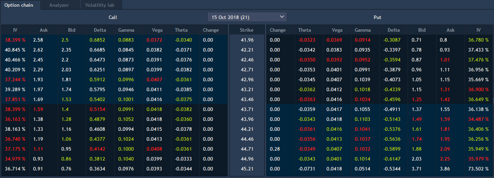

# Option chain

The option chain tab shows detailed information about specific option contract and allows to trade with it.

In Option chain tab the coloring method “By difference” is used. Depending on what type of price change comes at a certain strike to buy or sell, it is highlighted in green or red.

Check the needed option contracts in order to make them accessible for the trading in the Option chain tab.

* IV \(Implied volatility\) column – shows expected volatility of the option which characterizes the degree of underlier price volatility. If IV is high, strong fluctuations of underlier price are expected.

Edit the 'Trade' column opposite to the corresponding strike in order to add a position. Set negative value to open a short position, and positive to open a long position with the corresponding quantity. Immediately after adding all positions will have the "paper" status and will be displayed in the 'Test on paper' tab. To transfer "paper" positions to the really existing, check needed in the 'Send' column and click 'Place all' button. After placing these positions will be displayed in the Positions tab.

Double click on the selected row from strike table evokes Order entry panel pre-filled with selected account and strike.

Each specific strike row has a possibility to invoke its Context menu with options to open the following panels in one click: Order entry, Matrix, Market depth and Chart.

Use ‘Analyzer’ and ‘Volatility lab’ tabs to analyze "paper" positions before the real trading.

**Positions** tab shows actually existing positions by Options with previously selected in the Instrument lookup underlier; positions opened by this underlier can be also displayed here.

**Orders** tab shows all orders by Options with previously selected in the Instrument lookup underlier; orders created by this underlier can be also displayed here.

**Test on paper** tab shows all 'test on paper' results, and also all actually existing positions which form the portfolio. Use 'Analyze' and 'Send' checkboxes to manage the portfolio. Check/uncheck the corresponding boxes in order to define which positions need to be analyzed in Analyzer tab or opened. Use 'Place all' button in order to send all selected positions to the exchange. Click 'Remove' to delete the corresponding position.

Test on paper panel contains a very useful column “Link” which is hidden by default and is used to link current asset price to the column “Price” of created \(paper\) order. “Link” values: Ask, Bid and Last.

The following buttons of the tab allow the following actions:

* Add underlier – opens ‘Order entry’ panel
* Cancel all - cancels all 'test on paper' orders
* Place selected - places selected 'test on paper' orders

SL/TP for orders

If setting located in General settings -&gt; Trading defaults -&gt; Show SL/TP price in offset is checked, it is allowed to edit column SL \(TP\) offset; SL \(TP\) price/risk is not available for editing and is recalculated automatically. If unchecked, it is allowed to edit column SL \(TP\) price/risk; SL \(TP\) offset is not available for editing and is recalculated automatically.

