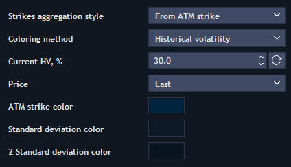
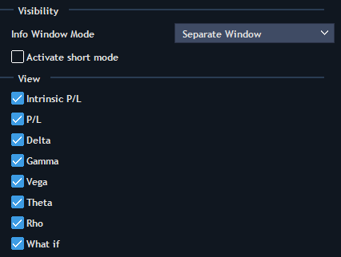

# Overview

The Option master panel shows detailed information about options, allows to analyze it and then to trade with selected option contracts.

To open a new Option master panel go to Terminal - &gt; Option master.


**Level 1 symbol data:**

Level 1 data information of the symbol that underlies the option contract was gathered in this block. This block can be easily customized through the Context menu.

**Account and symbol lookups:**

Here user can select an instrument that underlies the option which user is going to analyze; and also account for trading from Accounts lookup.

**Settings:**

Clicking on the button calls the dialog window Option master – settings. This block allows specifying general settings of the Option master panel. General settings tab is divided into three sections: General, Analyzer and Volatility lab.

**General:**


The section General has the following options:

* Pricing model – shows a price model, which will be used for calculation \(currently Black-Sholes model is only available\).
* Interest rate, % – allows selecting interest rate.
* IV calculation price – allows selecting price for IV value calculation from the drop-down list. The following values are available here: Ask, Bid, \(Ask + Bid\)/2 and Last.
* Show toolbar – allows showing toolbar.

**Option chain:**


* Strikes aggregation style – allows selecting style of strikes count from the drop-down list. There are two available styles:
  * From ATM strike – strikes are counted from the ATM strike, this is the default style of strikes aggregation;
  * Custom underlier price – allows choosing custom underlier price.
* Coloring method – allows selecting coloring scheme for Option chain tab: Classic or Historical volatility.

If coloring method is Classic, the following options can be selected:

```text
     ****In-the-money color – allows selecting 'In the money' color.

     Out-the-money-color – allows selecting 'Out the money' color.
```



If coloring method is Historical volatility, the following options can be selected: Current HV, % – shows current level of the historical volatility for the underlier \(Min = 0, Max = 1000, Step = 0.1\). Pressing the button allows to reset custom value of the historical volatility to the calculated value from the symbol chart by the selected price type \(described below\).

```text
    Price – allows specifying the underlier price from which sought values Std. and 2\*Std. will be plotted. The following prices are available here: Last, \(Bid + Ask\)/2, OHLC/4 and OHL/3.

    ATM strike color, Std. color, 2\* Std. color – standard setting for color selection.
```

**Coloring logic**

ATM strike color – it is a strike or 2 strikes, which are more closely located to the Last price of the underlier.

Std.1 = Price \* \(1-HV/SQRT\(365\)\*SQRT\(T\);

Std.2 = Price \* \(1+HV/SQRT\(365\)\*SQRT\(T\)\), where T is quantity of days remaining before the contract expiration.

All strikes inclusively, which fall within the range from Std.1 to Std.2, should be painted in the Std. color.

2Std.1 = Price \* \(1-2\*\(HV/SQRT\(365\)\*SQRT\(T\)\);

2Std.2 = Price \* \(1+2\*\(HV/SQRT\(365\)\*SQRT\(T\)\)\), where T is quantity of days remaining before the contract expiration.

All strikes inclusively, which fall within the range from 2Std.1 to 2Std.2, should be painted in the 2\*Std. color. Coloring of Std.color

occurs over 2\*Std.coloring.

**Analyzer:**


This tab allows specifying colors and style for displaying the main lines of the option position profile:

* Intrinsic – color, shape and thickness of the option intrinsic value line
* Time line - color, shape and thickness of the option time line
* Zero line - color, shape and thickness of the zero line
* Underlier price – color, shape and thickness of the line that indicates the underlier price

Probability simulations:

* Simulation model – available states: By absolute prices \(default value\), By relative prices and By logarithmic prices
* Simulation examples – \(Min = 100, Step =1, Default value = 1000, Digits = 0\)
* Probability scenario – available values: One touch \(default value\) and Out of range
* History Period, year – allows selecting a history period

View:

Coloring method – allows selecting coloring scheme for Analyzer tab: Historical volatility or None. Current HV, % – shows current level of the historical volatility for the underlier \(Min = 0, Max = 1000, Step = 0.1\). Pressing the button allows to reset custom value of the historical volatility to the calculated value from the symbol chart by the selected price type \(described below\).

Price – allows specifying the underlier price from which sought values Std. and 2\*Std. will be plotted. The following prices are available here: Last, \(Bid + Ask\)/2, OHLC/4 and OHL/3.

Standard deviation color, 2 Standard deviation color – standard setting for color selection.

**Volatility lab:**


The section Volatility lab allows to set up parameters of the Volatility lab tab of the Option master panel.

This section contains the following options:

* Basis – allows selecting Strike prices or Delta from the drop-down list.

Vanna-Volga model:

* Underlier price – allows selecting Forward price or Current last price from the drop-down list. In case the Forward price is selected, the following options are enabled for editing:
* 1. Domestic rate, % – value by default = 0; step = 0.01
  2. Foreign rate, % – value by default = 0; step = 0.01

The following options also can be set up:

* ATM strike price – at the money option's strike price
* ATM IV, % – at the money option's implied volatility
* Call strike price – some call option's strike price
* Call IV, % – implied volatility of selected call option
* Put strike price – some put option's strike price
* Put IV, % – implied volatility of selected put option

**Info Window:**



Visibility:

Info Window Mode – allows selecting Separate Window, Attached to Cursor or Hidden from the drop-down list.

Activate short mode – allows activating short mode.

View:

The following options can be activated: Intrinsic P/L, P/L, Delta, Gamma, Vega, Theta, Rho, What if.

Colors:

The style of a font can be selected.

**Positions/Orders information:** this block shows all information about positions, orders and 'test on paper' results.

**Panel navigation:** use this block in order to manage tabs of Option master panel.

**Info panel:** click on the buttonto enable/disable the information panel displaying.

This panel consists of 3 logical blocks:

* Current portfolio – displays total margin requirement by portfolio of actually existing positions.
* Portfolio + Analyzed paper positions – displays margin requirement changing in the case of adding "paper" positions to the portfolio.
* Portfolio greeks – shows total "greeks" value by current portfolio.

Greeks – are the coefficients which used for the characteristics of option cost \(premium\) sensitivity to the changing of various values: Delta, Gamma, Vega and Theta.

* Delta – is the first derivative of the option price by the underlier price; shows how option price will be changed in points, if the underlier price changes by 1 point.
* Gamma – is the second derivative of the option price by the underlier price; shows the rapidity of the option delta change.
* Vega – is the first derivative of the option price by volatility; shows how option price will be changed in points, if the volatility changes by 1%.
* Theta – is the first derivative of the option price by time; shows how the option price will be reduced after one day.

