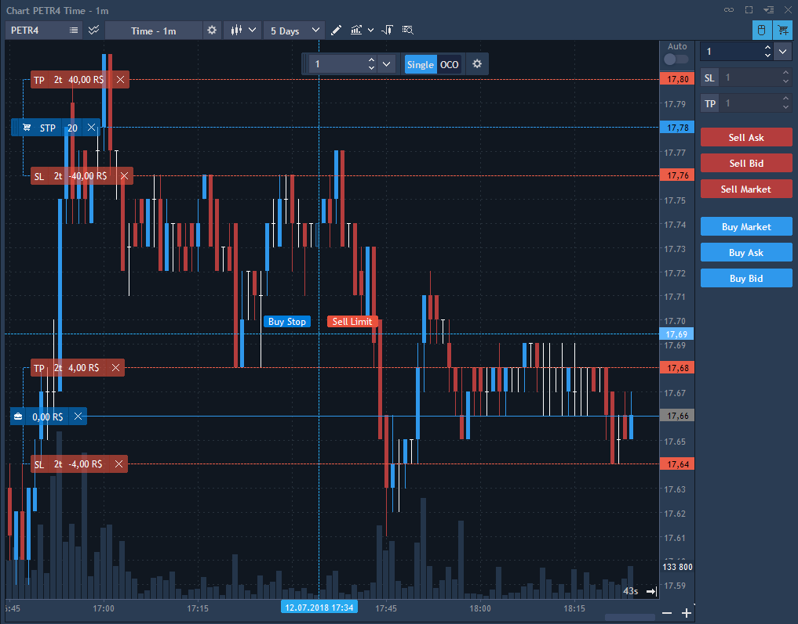
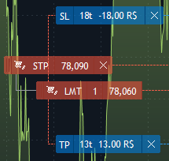
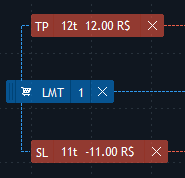

# Visual trading


You can perform trading directly from the chart panel. It is possible to send orders, modify and close/cancel all positions/orders directly from the chart:

### 
The built-in Order entry panel 

In order to start visual trading, click the 'Chart trading' button, 
located on the top right corner of the Chart toolbar, and built-in Order entry panel will be opened:

The Order entry panel consists of the following items:

1. Quantity - the order quantity;
2. SL - for specifying Stop Loss parameters;
3. TP - for specifying Take Profit parameters.

Hot buttons for one-click trading are the following:

* Sell Ask – to send a Sell Limit order at the Ask price;
* Sell Bid – to send a Sell Limit order at the Bid price;
* Sell Market – to send a sell market order;
* Buy Market – to send a buy market order;
* Buy Ask – to send a Buy Limit order at the Ask price;
* Buy Bid – to send a Buy Limit order at the Bid price;
* Close – to close all positions by selected symbol and account;
* Reverse – to reverse all positions by selected symbol and account;
* Cancel buy – to cancel buy orders by selected symbol and account;
* Cancel sell – to cancel sell orders by selected symbol and account;
* Cancel all – to cancel all orders by selected symbol and account.

### 
Chart trading

To start chart trading, follow these steps:

1. Оpen the built-in Order entry panel;
2. Click the 'Mouse trading' button
   to enable the chart trading;
3. Select type of an order to be placed: single or OCO.

You can enable chart trading by pressing and holding the Ctrl key as well.

If the cursor is higher than the current price, you can send:

* Buy Stop order – by left click;
* Sell Limit order – by right click.

If the cursor is lower than a current price, you can send:

* Buy Limit order – left click of the mouse;
* Sell Stop order – right click of the mouse.

Orders tooltips are always visible while trading:

If order is buy, then its icon is blue; and if order is sell, then its icon is red.

When allocating a Stop limit order on the chart, limit price and stop price are shown inside of the order marker.

To disable the chart trading, click the 'Mouse trading' button again, or just stop holding the Ctrl key.

### Order modifying

To change the order’s price, simply drag and drop the order marker
to the desirable price.

To start modifying another parameters, make a left click on the order marker. The following buttons will appear:

To cancel order, click on the button.

Right click on the order marker opens the context menu with various actions which could be done with an order. You can choose options which you need: Cancel order, Modify, Change to Market.  
  
 All modifying operations can be made from the Modify window which can be opened choosing option 'Modify' in the context menu:

  

### Stop loss and Take profit

If you need to set SL/TP to the order/position, make a left click on the order/position marker. After that, SL/TP markers appear. Drag and Drop SL/TP prices to modify them:

  
  
  

