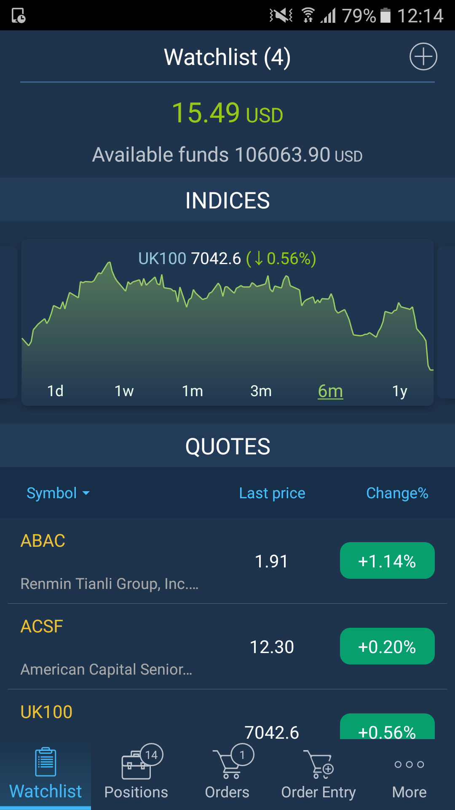
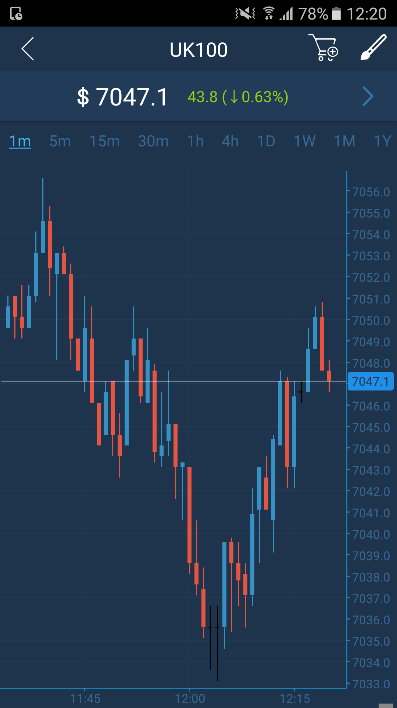
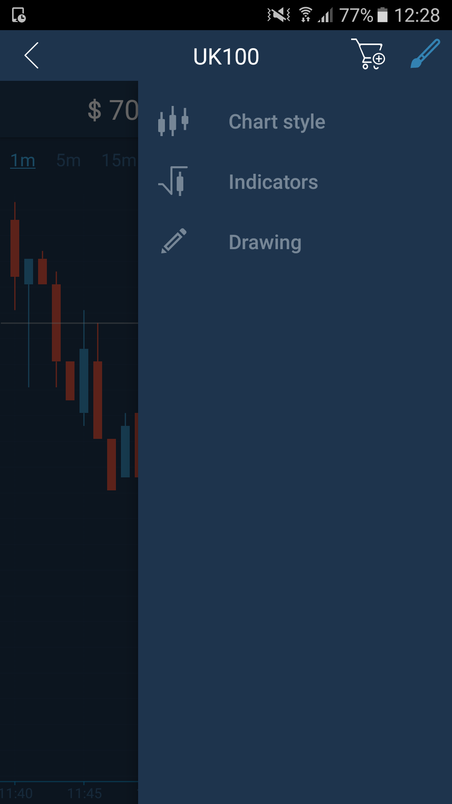
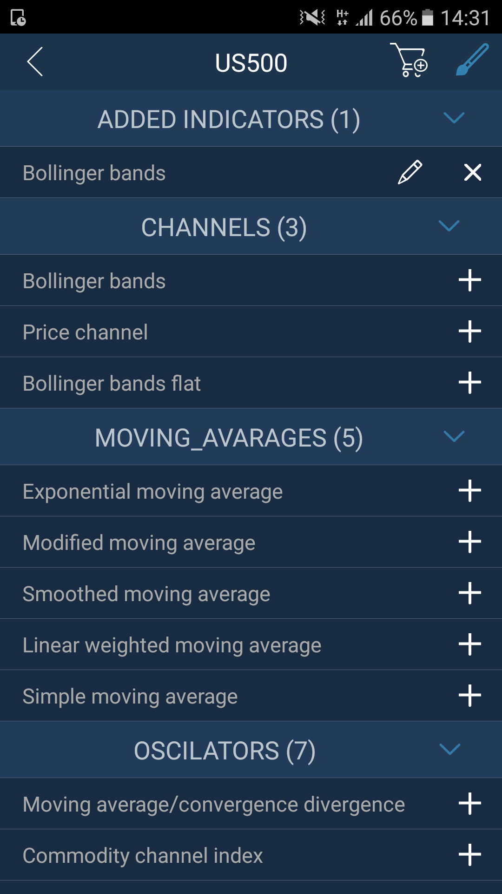
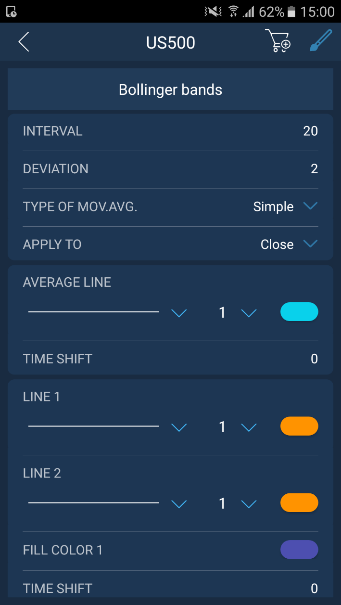
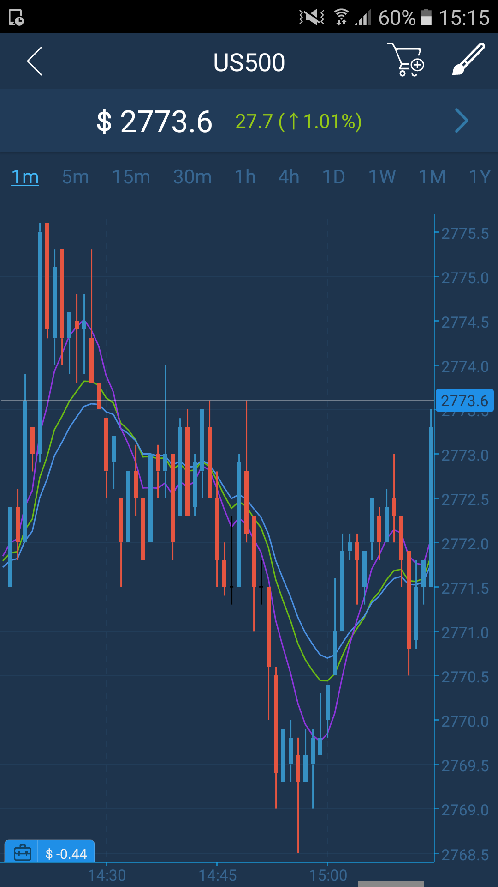
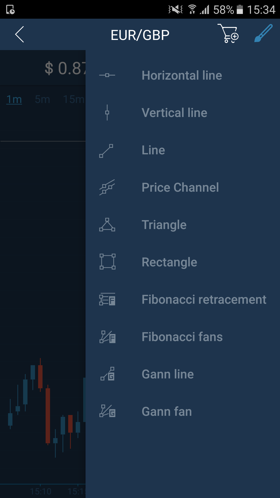
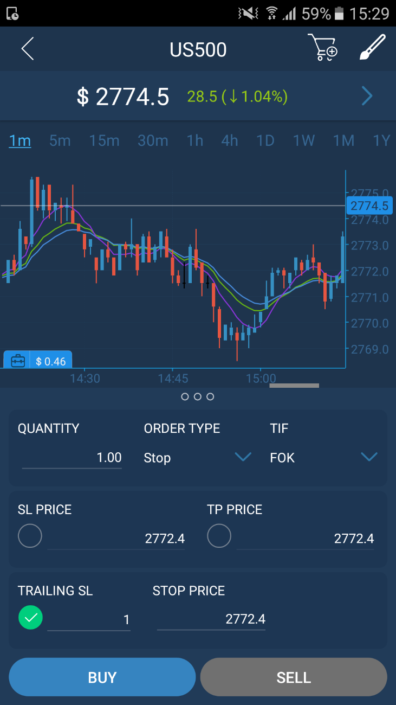

# Chart

The Chart screen can be accessed only from the Watchlist screen.

In the ‘Indices’ section swipe left or right the chart to change the symbol and choose the timeframe.

Tap the name of the symbol in the ‘Quotes’ section in order to open the chart:

**Chart toolbar**

Tap the buttonto open Chart toolbar.

The Chart toolbar consists of 3 buttons:

* Chart style – allows to choose the style of the chart. Available chart styles: Line, Bar, Candle, Dots, Dotted line, Histogram, Area.
* Indicators – allows to choose the needed indicator for technical analysis.
* Drawings – opens the drawing tools toolbar.

## **Indicators**

In order to add a new indicator, choose the category of indicators \(Channels, Moving averages, Oscillators etc.\) and tap the buttonnear the indicator name at the list of available Indicators.

It will appear in ‘Added indicators’ section and you can set indicator’s parameters by tapping the button. Tap the buttonlocated near indicator’s name to remove indicator from this section.

Open the chart to see the added indicators.

**Drawing tools**

Select the needed drawing tool from the 'Drawing' menu and place it manually on the chart.

**Order entry**

The Order entry screen enables user to send orders. The Order entry icon is located at the top right corner of the Chart screen.

Read more information about Order entry screen here:

[https://guide.xspot.markets/mobile-applications/phone/android/order-entry](https://guide.xspot.markets/mobile-applications/phone/android/order-entry)

