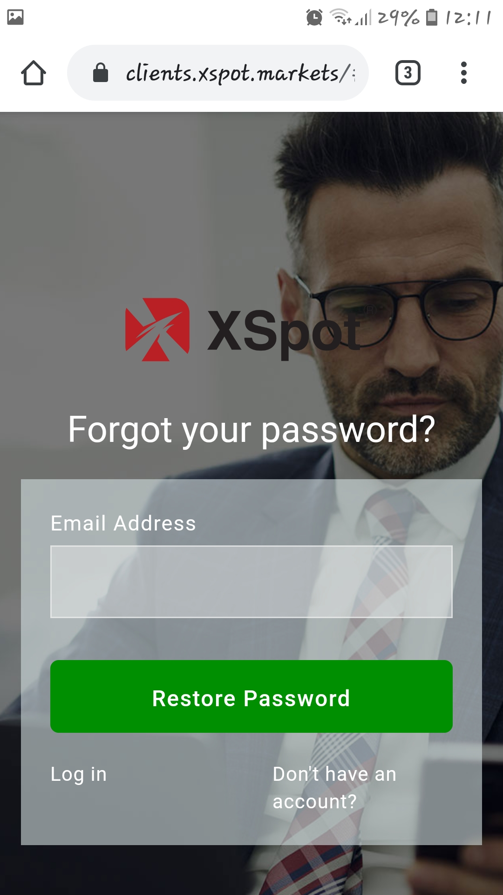

# Getting started

Logging in to the Mobile application is available via the main login screen:

Enter your valid login and password.

Mark 'Save password' as checked to store your log in credentials into the system.

Select the needed language of the application interface from the drop-down list \(the list allows selecting the application interface language independently of the device system language\).

Tap the button 'Log in'.

Note: to recover the application password, tap ‘Forgot’ option in the ‘Password’ field.

A pop-up window will open to recover the password.

Type your email address and tap the button "Restore Password". You will receive an email with your new password.

_\* Recommended Android version is 5.0 and higher_

