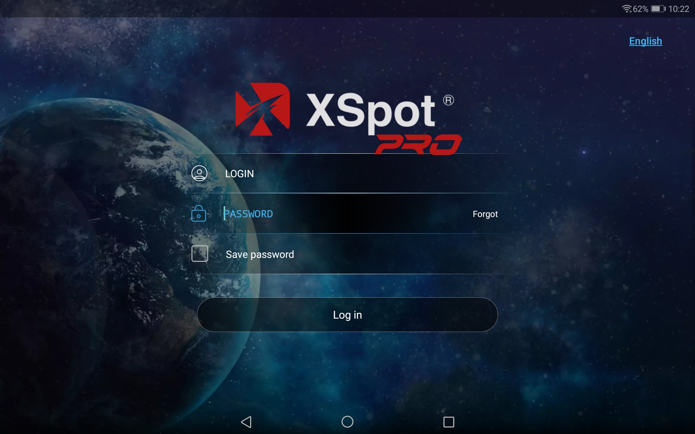
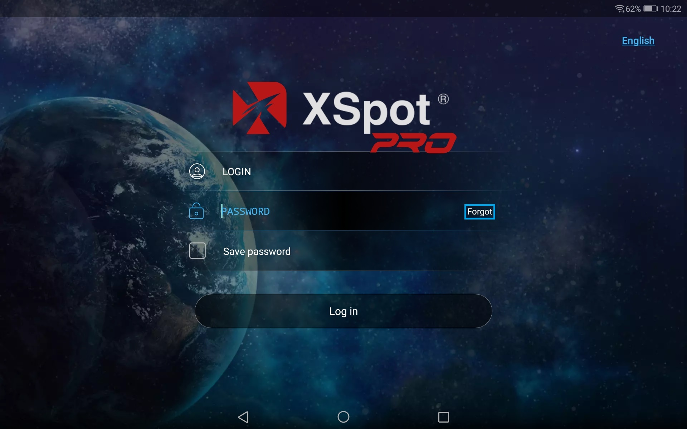
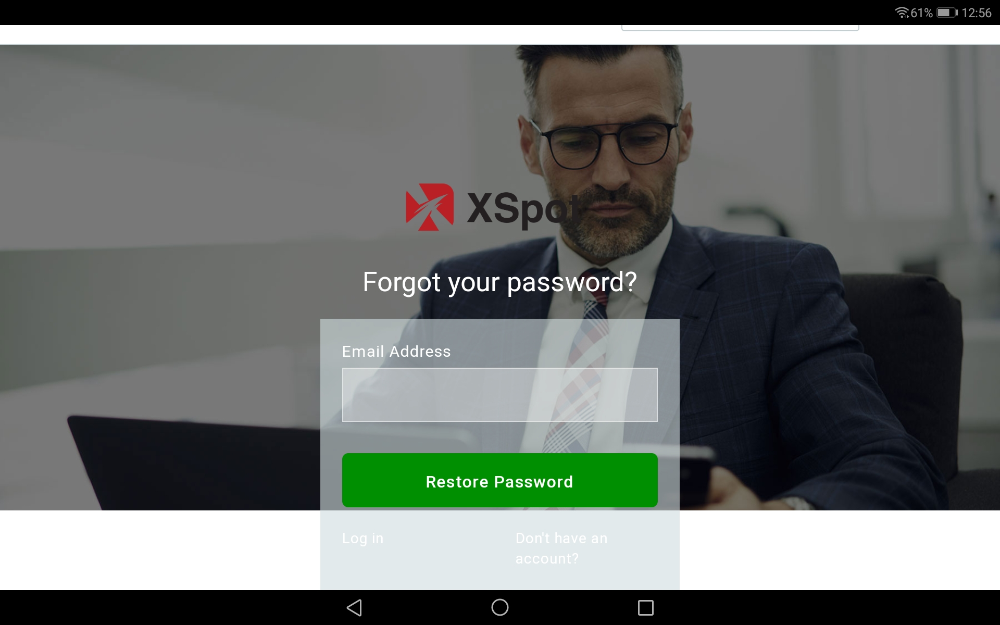

# Getting started

To log in to the application, use your valid login and password:

Check the 'Save password' if you want the app remembering your login credentials.

Select the needed language of the application interface in the drop-down list \(the list allows selecting the application interface language independently of the device system language\).

Tap the button 'Log in'.

Note: to recover the application password, tap ‘Forgot’ option in the ‘Password’ field.

A pop-up window will open to recover the password.

Type your email address and tap the button "Restore Password". You will receive an email with your new password.

_\* Recommended Android version is_ _5.0_ _and higher_

